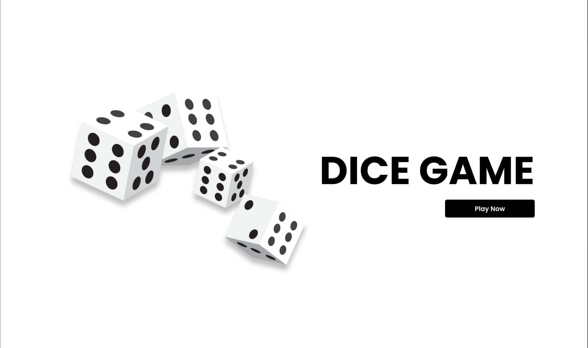

# React Practice Project

# 🎲 React Dice Game – Practice Project #3

This is my **third practice project in React**.  
The goal of this project was to build a **simple and interactive dice game** using reusable components, state management, and basic logic.

---

## 🧠 Game Logic

- The user selects a number between **1 to 6**
- Then rolls the dice
- If the dice matches the selected number → 🟢 **User gains that number of points**
- If not → 🔴 **User loses 2 points**
- Score updates live based on user’s success/failure

---

## ⚙️ Project Overview

- Built using **React functional components**
- Managed state with **useState hook**
- Components used:
  - `TotalScore`
  - `NumberSelector`
  - `StartGame`
  - `Rules`
  - `RoleDice`
  - `GamePlay`
- Used **styled-components** for styling and theming
- User feedback through error messages
- Modular code structure for clarity

---

## ✨ Features

- 🎯 Live dice rolling logic
- 🔢 Number selector UI with highlight on selection
- 🔁 Real-time score update
- 🎨 Styled using `styled-components`
- ❌ Error shown when dice is rolled without selecting number
- 🔄 Reset Score functionality
- 📦 Component-based clean architecture

---

## 💻 Technologies Used

- React.js (Vite setup)
- JavaScript (ES6)
- styled-components

---

## Screenshots

# Thank you for viewing my project!

